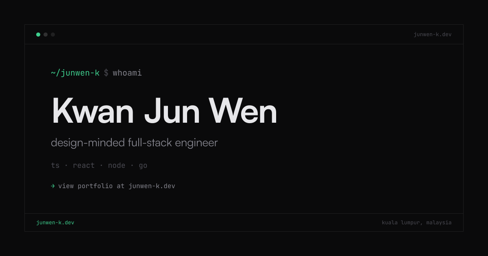

<!-- markdownlint-disable -->
<p align="center">
    <a href="https://junwen-k.dev" target="_blank" rel="noopener noreferrer">
        
    </a>
</p>
<!-- markdownlint-enable -->

```console
~ $ cat about.md
# about
Kwan Jun Wen — design-minded full-stack engineer.
TypeScript · React · Node.js · 8+ years.
Currently Lead Software Engineer @ Setel, Kuala Lumpur.
I care about interfaces where DX is not an afterthought.

~ $ cat .plan
ship good software. write music. repeat.
```

<!-- markdownlint-disable -->
<p align="center">
    <a href="https://junwen-k.dev">junwen-k.dev</a>&nbsp;&nbsp;·&nbsp;&nbsp;<a href="https://cv.junwen-k.dev">cv</a>&nbsp;&nbsp;·&nbsp;&nbsp;<a href="https://ui-x.junwen-k.dev">ui-x</a>&nbsp;&nbsp;·&nbsp;&nbsp;<a href="https://linktr.ee/steelpedal97">music</a>
</p>
<!-- markdownlint-enable -->
